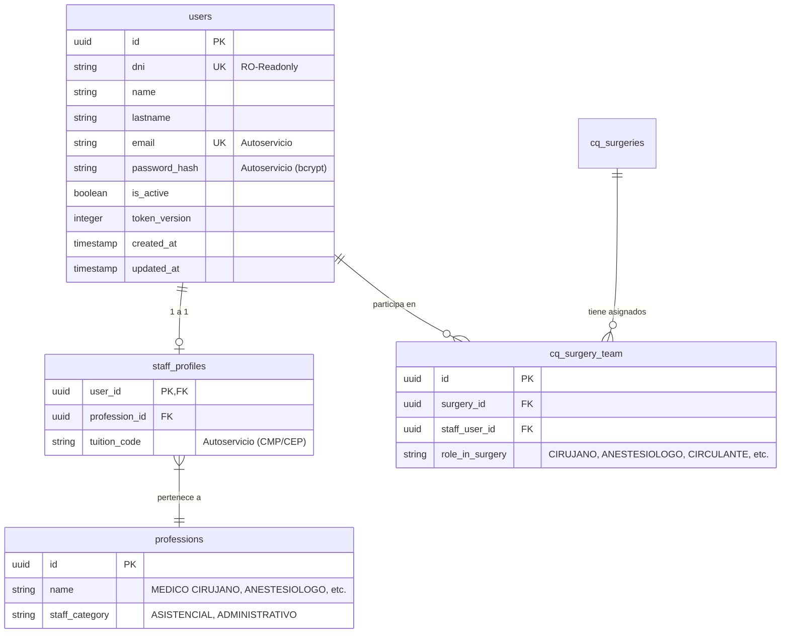

# 📘 TRASPASO TÉCNICO Y REGLAS DE CONVIVENCIA: BackCQ ➔ FrontCQ

Este documento sirve como **guía oficial de integración** para el agente y desarrolladores del proyecto **FrontCQ** (Portal de Autoservicio y Perfil de Usuarios/Médicos), el cual comparte la misma base de datos PostgreSQL de **BackCQ** (*Centro Quirúrgico - Hospital II-2 Tarapoto*).

---

## 🎯 Objetivo de la Integración

Permitir que el **Personal Asistencial** (Médicos Cirujanos, Anestesiólogos, Enfermeros, etc.) pueda gestionar su **Perfil de Autoservicio** desde el portal web **FrontCQ** (actualizando su correo electrónico, teléfono, dirección, código de colegiatura o contraseña) **sin comprometer la integridad ni romper la lógica operativa de BackCQ**.

---

## 🗄️ Esquema de Base de Datos Compartido

Ambos sistemas se conectan a la base de datos PostgreSQL compartida. Las tablas principales del personal son:



---

## ✍️ Reglas de Modificación de Campos por Autoservicio (FrontCQ)

### 1. Campos PERMITIDOS para Actualización en FrontCQ
| Campo en DB | Tabla | Descripción | Regla de Validación | Efecto en BackCQ |
| :--- | :--- | :--- | :--- | :--- |
| `email` | `users` | Correo electrónico personal/institucional | **Único (`UNIQUE`)**, formato `user@domain.com`, trim, minúsculas. Si se envía vacío, guardar como `null`. | **CRÍTICO:** `BackCQ` usará este correo para notificar automáticamente al médico sobre sus cirugías asignadas (`sendSurgeryNotificationEmailAction`). |
| `tuition_code` | `staff_profiles` | Código de Colegiatura (CMP, CEP, etc.) | String limpio sin espacios extra (ej: `CMP 074821`). | Aparecerá reflejado en la agenda de firmas y reportes en PDF/Excel de BackCQ. |
| `password_hash` | `users` | Contraseña de acceso al sistema | **Obligatorio usar `bcrypt.hash(password, 10)`**. Nunca guardar en texto plano. | Permite al médico iniciar sesión tanto en FrontCQ como en BackCQ con su misma contraseña. |
| `updated_at` | `users` | Fecha de actualización | Siempre actualizar a `new Date()` / `now()`. | Control de auditoría. |

### 2. Campos PROHIBIDOS para Edición (Solo Lectura en FrontCQ)
- ❌ **`users.dni`**: Identificador nacional único. No debe ser modificado por autoservicio.
- ❌ **`users.is_active`**: Estado de cuenta (bloqueado/activo). Administrado exclusivamente por `BackCQ` / `BackAdmin`.
- ❌ **`users.token_version`**: Reservado para invalidación masiva de tokens.
- ❌ **`staff_profiles.profession_id`**: La profesión médica (Cirujano, Anestesiólogo) solo la asigna Recursos Humanos / Administración en BackCQ.

---

## ⚡ Convivencia Directa: Notificaciones por Correo Electrónico

1. **BackCQ** cuenta con un **Sistema de Notificaciones por Correo en Tiempo Real** mediante SMTP de Gmail (`hospitaltarapotocoordinacion@gmail.com`).
2. Cada vez que `FrontCQ` actualiza el campo `users.email` de un médico:
   - Al instante siguiente que se programe, edite o notifique manualmente (`✉️`) una cirugía en `BackCQ`, el sistema enviará la tarjeta HTML de la jornada quirúrgica al **nuevo correo guardado**.
3. **Recomendación para FrontCQ**: Al actualizar el correo, mostrar un aviso al médico:  
   *`"Tu correo ha sido actualizado. A partir de este momento recibirás las notificaciones de tus cirugías programadas en este buzón."`*

---

## 🔒 Compatibilidad con NextAuth y Autenticación
- **BackCQ** utiliza `NextAuth` con proveedor `Credentials`.
- `FrontCQ` debe usar la misma estrategia de hash:
  ```typescript
  import bcrypt from 'bcrypt';
  const hashedPassword = await bcrypt.hash(newPassword, 10);
  ```
- Al cambiar la contraseña en `FrontCQ`, el médico podrá entrar inmediatamente a `BackCQ` con su nueva clave.
